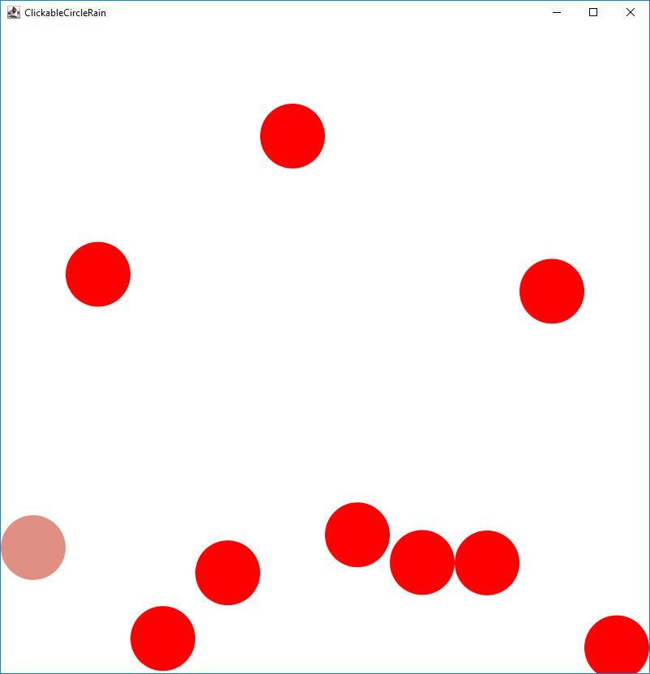

# U18 | Clickable CircleRain

Wer erinnert sich nicht? Die hübschen, fallenden Kreise aus Übung 4 sind wieder zurück. Diesmal setzen Sie Ihr neu erlangtes Wissen über Maus-Interaktion ein, um Nutzern zu erlauben, alle Kreise rot zu färben. Im Starterpaket ist ein Lösungsvorschlag für die CircleRain-Aufgabe enthalten. Ihre Aufgabe ist es, die `onMousePressed`-Methode zu implementieren und darin zu prüfen, ob ein Kreis getroffen wurde und ihn einzufärben, falls dies der Fall ist. Die Anwendung soll, wenn alle Kreise rot gefärbt wurden, wieder alle Kreise zurücksetzen und dabei neu einfärben bzw. ihnen neue Geschwindigkeiten zuweisen.

{ width=25% }
